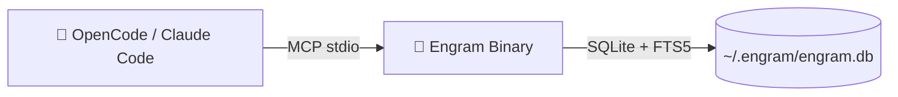
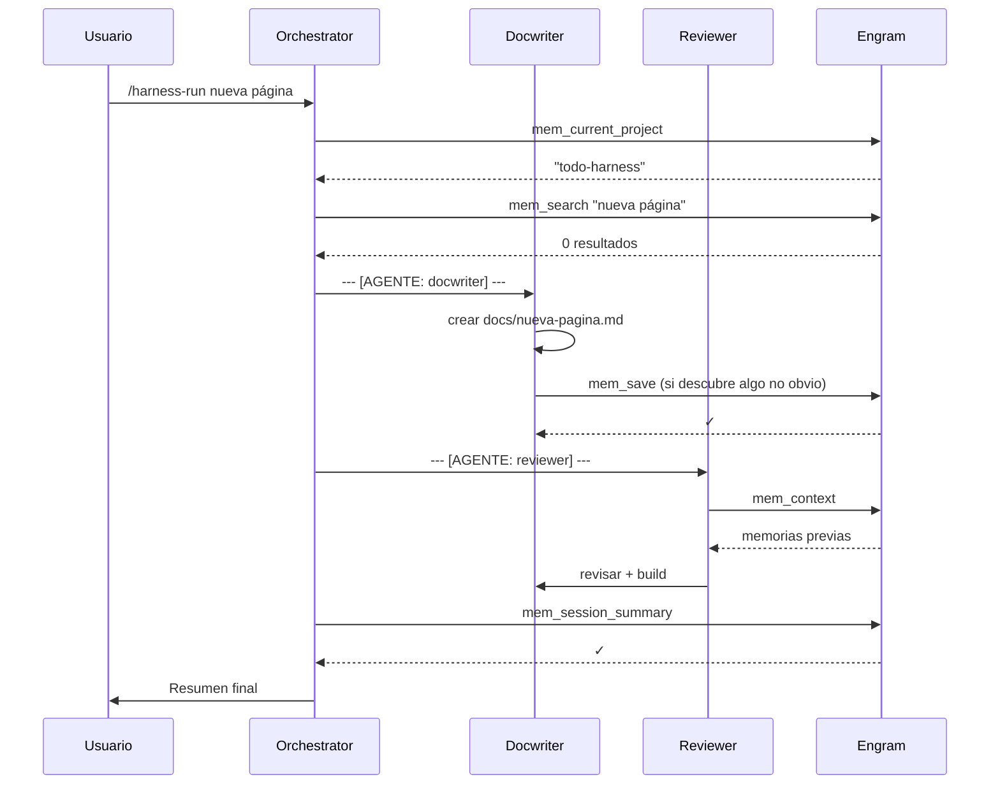

## ¿Por qué memoria persistente?

!!! note "🧠 Analogía"
    Tu agente IA es brillante pero amnésico. Cada vez que cierras la sesión, olvida todo: las decisiones que tomaste, los bugs que encontraste, los patrones que estableciste. Engram es el cuaderno que siempre está sobre la mesa — el agente escribe lo importante y lo lee al día siguiente.

| Dimensión | Sin Engram | Con Engram |
|---|---|---|
| **Contexto entre sesiones** | Cero — empieza de cero cada vez | `mem_context` recupera el historial |
| **Decisiones de arquitectura** | Las repites en cada sesión | `mem_search` las encuentra al instante |
| **Bugs ya corregidos** | Puede reintroducirlos sin saberlo | `mem_save` los recuerda y documenta |
| **Patrones del proyecto** | No aprende de experiencia previa | `topic_key` actualiza en place |
| **Cierre de sesión** | Se pierde todo el contexto | `mem_session_summary` persiste el resumen |

### Encaje en el harness

El harness ya coordina agentes que comparten archivos, specs y skills. Engram añade una capa de **memoria compartida entre sesiones**: el orchestrator usa `mem_search` antes de planificar, backend usa `mem_save` para guardar patrones de implementación, y reviewer usa `mem_context` para recordar findings de revisiones anteriores.

---

## ¿Qué es Engram?

`engram` `/ˈen.ɡræm/` — *neuroscience*: la huella física de una memoria en el cerebro.

Un **binario Go** con SQLite + FTS5 full-text search, expuesto vía MCP server, HTTP API, CLI y TUI. Agent-agnostic: funciona con OpenCode, Claude Code, Gemini CLI, Codex, Cursor, VS Code Copilot y cualquier cliente MCP. <sup>[[12]](references.md#ref12)</sup>



No necesita Node.js, Python ni Docker. Un binario, una base de datos.

---

## Instalación

### macOS / Linux — Homebrew

```bash
brew install gentleman-programming/tap/engram
```

Para actualizar:

```bash
brew update && brew upgrade engram
```

### Linux / Windows — Binario

Descargar el binario para tu plataforma desde [GitHub Releases](https://github.com/Gentleman-Programming/engram/releases) y añadirlo al PATH.

### Verificar instalación

```bash
engram version
```

---

## Configuración con OpenCode

!!! note "🔌 Analogía"
    OpenCode funciona solo, pero sin Engram es como un coche sin cuaderno de bordo: va, pero no recuerda por dónde pasó. Engram añade la memoria al conductor.

### Opción automática (recomendada)

```bash
engram setup opencode
```

Este comando hace tres cosas:

**1. Plugin** — copia `engram.ts` a `~/.config/opencode/plugins/`

- Session tracking automático
- Memory Protocol inyectado en el agente
- Recuperación post-compaction

**2. MCP server** — añade la configuración a `opencode.json`

```json
{
  "mcp": {
    "engram": {
      "type": "local",
      "command": ["engram", "mcp", "--tools=agent"],
      "enabled": true
    }
  }
}
```

**3. Statusline** — añade indicador de actividad del sub-agente en `tui.json`

Después del setup, **reinicia OpenCode**. No necesitas ejecutar `engram serve` manualmente — el plugin gestiona el servidor.

### Opción manual (sin plugin)

Si prefieres configurar solo el MCP server sin el plugin, añade directamente a `opencode.json` (global: `~/.config/opencode/opencode.json`, o por proyecto):

```json
{
  "mcp": {
    "engram": {
      "type": "local",
      "command": ["engram", "mcp"],
      "enabled": true
    }
  }
}
```

!!! warning "Sin plugin = sin session tracking"
    Sin el plugin, Engram funciona pero no hace session tracking automático. Tendrás que llamar a `mem_session_summary` manualmente al final de cada sesión. El plugin lo hace automático.

### Memory Protocol

Para que el agente sepa **cuándo** usar Engram, añade este snippet al prompt del agente en `opencode.json`:

```
You have access to Engram persistent memory via MCP tools (mem_save, mem_search, mem_session_summary, etc.).
Save proactively after significant work — don't wait to be asked.
After any compaction or context reset, call mem_context to recover session state before continuing.
```

Esto es la opción "nuclear" — el prompt del sistema sobrevive a la compaction. Úsalo cuando quieras garantía absoluta de que el agente usará Engram.

---

## Herramientas MCP — 20 tools

<div class="grid cards cozy-cards" markdown>

-   :lucide-save:{ .lg .middle } __Guardar__

    ---

    `mem_save` · `mem_update` · `mem_delete` · `mem_suggest_topic_key`

-   :lucide-search:{ .lg .middle } __Buscar__

    ---

    `mem_search` · `mem_context` · `mem_timeline` · `mem_get_observation`

-   :lucide-play:{ .lg .middle } __Sesión__

    ---

    `mem_session_start` · `mem_session_end` · `mem_session_summary`

-   :lucide-git-compare:{ .lg .middle } __Conflictos__

    ---

    `mem_judge` · `mem_compare`

-   :lucide-wrench:{ .lg .middle } __Utilidades__

    ---

    `mem_save_prompt` · `mem_stats` · `mem_capture_passive` · `mem_merge_projects` · `mem_current_project` · `mem_doctor`

</div>

### Referencia de herramientas principales

| Herramienta | Descripción |
|---|---|
| `mem_current_project` | Detecta el proyecto desde el directorio de trabajo. Llamar primero. |
| `mem_save` | Guarda una observación estructurada con formato What/Why/Where/Learned |
| `mem_search` | Búsqueda full-text con FTS5 across todas las memorias |
| `mem_context` | Devuelve el contexto reciente de sesiones anteriores |
| `mem_session_summary` | Guarda el resumen de cierre de sesión (obligatorio antes de terminar) |
| `mem_suggest_topic_key` | Sugiere una key estable para upserts antes de `mem_save` |
| `mem_update` | Actualiza una observación existente por ID |
| `mem_timeline` | Contexto cronológico alrededor de una observación |
| `mem_get_observation` | Obtiene el contenido completo sin truncar de una memoria |
| `mem_judge` | Registra un veredicto sobre un conflicto pendiente |
| `mem_compare` | Persiste una relación semántica entre dos memorias |
| `mem_delete` | Elimina una observación (soft-delete por defecto, `--hard` permanente) |

!!! tip "Progresión de 3 capas — eficiente en tokens"
    No cargues toda la memoria de golpe. Usa la progresión:
    1. `mem_search "auth middleware"` → resultados compactos con IDs (~100 tokens c/u)
    2. `mem_timeline observation_id=42` → qué pasó antes/después en esa sesión
    3. `mem_get_observation id=42` → contenido completo sin truncar

---

## Flujo de trabajo: Ejemplo con OpenCode

### Terminal — OpenCode session

```
abres OpenCode en tu proyecto
cd todo-harness
opencode

tú: /harness-run añadir campo priority (high/medium/low) a los todos

orchestrator:
  --- [AGENTE: orchestrator] ---

  mem_current_project → "todo-harness" ✓
  mem_search "priority" → 0 resultados (tema nuevo)

  Leyendo openspec/specs/todo-crud/spec.md...
  No existe spec para priority. Creando proposal...

  Creando openspec/changes/add-priority/proposal.md ✓
  Creando openspec/changes/add-priority/tasks.md    ✓

  Plan: 8 tareas, requiere migración Alembic, backward compatible.
  ¿Implemento?

tú: sí

orchestrator:
  --- [AGENTE: backend] ---

  Tarea 1: Añadiendo campo priority al modelo Todo...
  Tarea 2: Generando migración Alembic...
  → Revisando migración generada manualmente...
  Tarea 3: Aplicando migración...
  Tarea 4: Actualizando schemas...
  Tarea 5: Añadiendo filtro ?priority=...
  Ejecutando: uv run pytest ✓ 14 tests pasados

  mem_save(
    title="Patrón migración NOT NULL con default",
    type="pattern",
    topic_key="pattern/db-migration-not-null",
    content="What: Usar server_default en columnas NOT NULL\n
             Why: Evita error en tablas con datos existentes\n
             Where: app/models/todo.py, alembic/versions/\n
             Learned: Nunca usar Base.metadata.create_all en producción"
  ) ✓

  --- [AGENTE: reviewer] ---

  mem_context → "todo-harness" → 3 memorias previas encontradas
  mem_search "migración" → patrón de backend encontrado ✓

  Verificando capas... ✓
  Usando MCP postgres: \d todos...
    → Columna priority presente: VARCHAR NOT NULL DEFAULT 'medium' ✓
  Findings:
    SUGGESTION: añadir índice en priority para queries de filtro

  --- [AGENTE: docwriter] ---

  Actualizando docstrings de endpoints afectados ✓

  --- [AGENTE: orchestrator] --- Resumen final ---

  mem_session_summary(
    content="
    ## Goal
    Añadir campo priority (high/medium/low) a los todos

    ## Discoveries
    - server_default es el patrón seguro para columnas NOT NULL en tablas con datos
    - El reviewer sugiere índice en priority para queries de filtro

    ## Accomplished
    - ✅ Campo priority añadido al modelo y schemas
    - ✅ Migración Alembic aplicada y verificada
    - ✅ 16 tests en verde
    - ✅ Sin blockers

    ## Next Steps
    - Evaluar si el índice en priority es necesario antes del PR

    ## Relevant Files
    - app/models/todo.py — campo priority añadido
    - alembic/versions/add_priority.py — migración generada
    - app/schemas/todo.py — schemas actualizados
    "
  ) ✓

  Resumen:
  ✓ 16 tests en verde
  ✓ Migración verificada en BD
  ✓ Patrón guardado en memoria para futuras migraciones
  → Suggestion pendiente: índice en priority
  → Listo para PR
```

!!! info "🎯 Lo que Engram aporta al harness"
    Sin Engram, la próxima vez que ejecutes `/harness-run`, el orchestrator no recordará que usaste `server_default` en la migración anterior. Con Engram, `mem_search "migración"` devuelve el patrón completo — el agente aprende de sesiones pasadas sin que tú le vuelvas a explicar.

---

## Workflow completo: Harness + Engram

### Integración con los comandos

Los comandos del harness ya incluyen llamadas a Engram:

**`/harness-run`** usa Engram en dos momentos:

1. **Al inicio** (paso ANALIZAR):
   - `mem_current_project` → confirma el proyecto detectado
   - `mem_search "$ARGUMENTS"` → busca contexto previo relacionado con la tarea

2. **Al final** (paso REPORTE FINAL):
   - `mem_session_summary` → guarda Goal/Discoveries/Accomplished/Next Steps/Relevant Files

**`/harness-proposal`** usa Engram al inicio:

1. **BUSCAR CONTEXTO**:
   - `mem_search "$ARGUMENTS"` → verifica que no existe una propuesta o decisión similar previa

### Flujo visual



---

## Topic Keys — Organización de memorias

### ¿Qué es un topic_key?

`topic_key` convierte `mem_save` en un **upsert**: si ya existe una memoria con el mismo `project + scope + topic_key`, se actualiza en lugar de crear una fila nueva. Ideal para conocimiento que evoluciona con el tiempo.

### Formato

Slash-separated lowercase kebab-case, máximo 2 niveles:

```
family/specific-description
```

### Cuándo usarlo

| Situación | ¿Usar topic_key? | Razón |
|---|---|---|
| Decisión de arquitectura que puede evolucionar | Sí | Mantiene el historial en una sola observación |
 Feature que abarca varias sesiones | Sí | Fuente única de verdad transversal |
| Patrón o convención establecida | Sí | Una entrada canónica que madura |
| Bug corregido y cerrado | No | Una observación puntual es suficiente |
| Descubrimiento one-off | No | Crear una key que no reutilizarás añade ruido |
| Múltiples decisiones independientes del mismo tema | No — usar keys distintas | Se sobreescribirían entre sí |

### Ejemplo completo

```bash
# El agente no está seguro de qué key usar
mem_suggest_topic_key(type="architecture", title="Auth model")
→ devuelve: "architecture/auth-model"

# Primera vez: crea la observación
mem_save(
  title="Usamos JWT para auth",
  type="architecture",
  topic_key="architecture/auth-model",
  content="What: JWT con refresh tokens\nWhy: Stateless, escalable\nWhere: app/auth/\nLearned: Rotación cada 7 días"
)
→ crea observación (revision_count=1)

# Sesión siguiente: actualiza la misma observación
mem_save(
  title="Cambiamos a Session-based auth",
  type="architecture",
  topic_key="architecture/auth-model",
  content="What: Sessions con Redis\nWhy: JWT no permitía revocación\nWhere: app/auth/, app/middleware/\nLearned: Redis TTL de 24h"
)
→ actualiza observación (revision_count=2) — NO crea fila nueva
```

### Familias de topic keys

| Familia | Para qué |
|---|---|
| `architecture/*` | Decisiones de diseño y arquitectura |
| `bug/*` | Bugs corregidos y sus causas raíz |
| `decision/*` | Decisiones explícitas con tradeoffs |
| `pattern/*` | Convenciones de naming, estructura, código |
| `config/*` | Configuración del entorno y proyecto |
| `discovery/*` | Hallazgos no obvios sobre el codebase |
| `feature/*` | Features en desarrollo que abarcan sesiones |

---

## Referencias

- **GitHub**: <https://github.com/Gentleman-Programming/engram>
- **Documentación completa**: <https://github.com/Gentleman-Programming/engram/blob/main/DOCS.md>
- **Agent Setup**: <https://github.com/Gentleman-Programming/engram/blob/main/docs/AGENT-SETUP.md>
- **Arquitectura**: <https://github.com/Gentleman-Programming/engram/blob/main/docs/ARCHITECTURE.md>
- **Instalación**: <https://github.com/Gentleman-Programming/engram/blob/main/docs/INSTALLATION.md>
